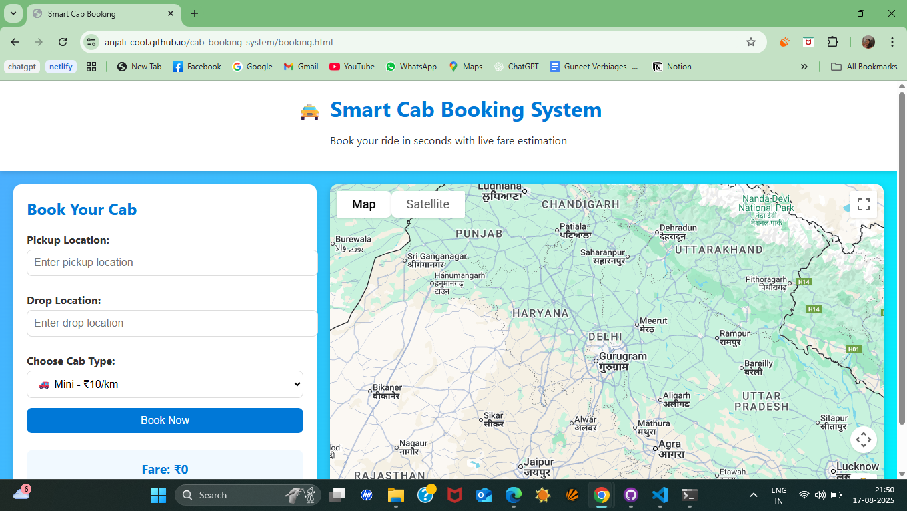

# Cab Booking System

A responsive **Cab Booking System** with a landing page, live fare calculation, and Google Maps integration. Users can select pickup and drop locations, choose cab type, and see fare estimation in real-time.

---

## 🔗 Live Demo
Check it out live: [Cab Booking System](https://YOUR-USERNAME.github.io/cab-booking-system/)

---

## ✨ Features
- Interactive landing page
- Pickup and drop location input
- Distance and fare calculation
- Cab type selection
- Google Maps route visualization

---

## 🖼 Screenshots
  
  

*(Create a folder named `screenshots` and put your images there)*

---

## 💻 Installation / How to Run Locally
1. Clone the repository:
   ```bash
   git clone https://github.com/YOUR-USERNAME/cab-booking-system.git
